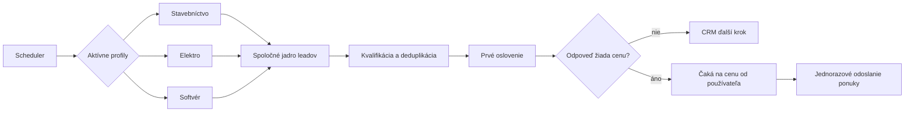

# Návrh: obchodný lead agent

## Rola agenta

Pracovný názov je **Obchodný agent pre zákazky**. Nie je to stavebný predák: predák riadi realizáciu a ľudí na stavbe, zatiaľ čo tento agent riadi obchodný proces pred získaním zákazky.

Jeho cieľom je dostať príležitosť od nájdenia po merateľný obchodný výsledok:

`nájdená príležitosť → kvalifikovaný lead → prvé oslovenie → odpoveď → cena/obhliadka → ponuka → prijatá alebo zamietnutá zákazka`

Agent pracuje dvoma cestami:

1. **Reaguje na existujúce dopyty a ponuky práce** z portálov, webov firiem a iných schválených zdrojov.
2. **Aktívne vyhľadáva firmy**, ktoré zodpovedajú cieľovému profilu, a po schválení kampane ich osloví.

### Čo môže vybaviť samostatne

- pravidelne prehľadávať schválené zdroje,
- uložiť zdroj, dátum a dôkaz, že zákazka je aktuálna,
- odstrániť duplicity a zoradiť príležitosti podľa zhody a odhadovanej hodnoty,
- dohľadať a overiť zverejnený firemný kontakt,
- poslať schválený typ prvého oslovenia v rámci limitu kampane,
- sledovať odpovede, odhlásenia a termíny,
- poslať jeden vopred schválený follow-up,
- vypýtať si rozsah prác, miesto, termín a ďalšie chýbajúce údaje,
- navrhnúť odpoveď, cenovú ponuku alebo termín telefonátu,
- zapísať celý priebeh do CRM a upozorniť na ďalší krok.

### Kedy musí zastaviť a upozorniť používateľa

- treba určiť alebo zmeniť cenu,
- nie je jasný rozsah, termín alebo dostupná kapacita,
- zákazník chce záväzný prísľub, zľavu, obhliadku alebo rokovanie,
- treba poslať zmluvu, právne vyhlásenie, osobný dokument alebo citlivý údaj,
- odpoveď je nejasná alebo môže spôsobiť finančný či reputačný záväzok.

Agent nesmie sám vymyslieť kvalifikáciu, kapacitu, referenciu, cenu ani právnu identitu. Za úspech prvej verzie sa považuje kvalifikovaná príležitosť, dohodnutý kontakt alebo ponuka odoslaná po cenovom rozhodnutí používateľa; získanie zákazky nemožno garantovať.

## Rozhodnutie

Rozšíriť existujúci projekt `C:\Users\pc\Documents\cestakodovanim\lead_agent`. Nový MCP server zatiaľ netreba. Existujúci systém už obsahuje databázu firiem, výber kandidátov, overovanie kontaktov, kampane, denné limity, suppression zoznam, prijímanie odpovedí a bezpečné jednorazové odoslanie.

Jadro systému môže byť všeobecné, ale každý obchodný beh musí patriť do jedného samostatného profilu. Agent, ktorý v jednej kampani mieša stavebníctvo, elektro a softvér, by produkoval slabé leady, nepresné správy a nevyhodnotiteľné výsledky.

## Tri obchodné línie

| Priorita | Línia | Stav | Rozhodnutie |
|---|---|---|---|
| 1 | Stavebné práce | Dodateľné teraz | Prvý 30-leadový pilot |
| 2 | Elektro | Dodateľné teraz, presný rozsah treba potvrdiť | Druhý oddelený pilot po vyhodnotení prvého |
| 3 | Softvér | Budúca línia bez potvrdenej ponuky | Zatiaľ iba pripravený profil; nespúšťať outreach |

Spoločné budú databáza, deduplikácia, spracovanie odpovedí, upozornenia, cenová brána, odosielanie a metriky. Každá línia bude mať vlastné zdroje leadov, filtre, ponuku, šablónu, cenník, odosielateľa a limity.

## Pracovný tok MVP

1. **Nastavenie obchodného profilu a kampane**
   - presne jedna obchodná línia,
   - jedna konkrétna služba alebo ponuka,
   - jasná lokalita a typ firmy,
   - zdroje leadov,
   - schválená prvá správa,
   - denný limit 5 správ a celkový pilot 30 firiem.
2. **Denný prieskum**
   - jeden beh v pracovný deň,
   - nájde nové firmy alebo dopyty,
   - ku každému uloží zdrojovú URL, dátum, dôvod zhody a skóre,
   - vyradí duplicity, už oslovené firmy a odhlásené kontakty.
3. **Kvalifikácia**
   - klasický kód kontroluje povinné údaje, limity a stav kontaktu,
   - LLM iba zoradí leady a navrhne personalizovaný text,
   - automaticky možno použiť iba zverejnený a overený firemný kontakt.
4. **Prvé oslovenie**
   - po jednorazovom schválení cieľovej skupiny a šablóny odošle najviac denný limit,
   - každá správa identifikuje odosielateľa a umožní jednoduché odhlásenie,
   - nejasný výsledok odoslania sa označí `unknown`; automaticky sa neopakuje.
5. **Spracovanie odpovede**
   - `not_interested` → ukončiť kontakt,
   - `opted_out` → suppression zoznam,
   - `interested` → vytvoriť obchodnú úlohu,
   - `needs_price` → vytvoriť požiadavku na cenu a upozorniť používateľa,
   - nejasná odpoveď → manuálna kontrola.
6. **Cenová ponuka**
   - používateľ zadá napríklad: `Lead #123: 38 €/h bez DPH, doprava 0,35 €/km, platnosť 14 dní. Odošli.`
   - systém skontroluje, že lead #123 čaká na cenu a že mena, jednotka, DPH a platnosť sú vyplnené,
   - vytvorí presný náhľad ponuky a cenu naviaže na túto jednu požiadavku,
   - atomicky zmení stav `awaiting_price → sending → sent`, aby sa ponuka neposlala dvakrát,
   - LLM nesmie cenu dopočítať, meniť ani schváliť.
7. **Meranie**
   - počet nájdených a kvalifikovaných leadov,
   - doručenie, odpovede, pozitívny záujem,
   - požiadavky na cenu, odoslané ponuky a získané zákazky,
   - po prvých 30 firmách rozhodnúť, či upraviť ponuku alebo pokračovať.

## Stavy a dátové objekty

`BusinessLine`: `construction | electrical | software`

`CampaignProfile`: obchodná línia, ponuka, región, ideálny zákazník, zdroje, kvalifikačné pravidlá, jazyk, odosielateľ a limity.

`Prospect`: `new → qualified → contacted → replied`

`QuoteRequest`: `awaiting_price → ready → sending → sent | unknown | cancelled`

Požiadavka na cenu potrebuje: lead, pôvodnú odpoveď, cenu, menu, jednotku, DPH, dopravu alebo rozsah, platnosť, čas zadania a jednorazový identifikátor odoslania.

## Intervaly a upozornenia

- Spoľahlivý denný beh má robiť jeden systémový scheduler pri aplikácii, nie LLM slučka.
- Codex heartbeat môže zobrazovať výsledky a upozornenia, ale funguje iba keď je aplikácia aktívna.
- Prvý návrh intervalu: pondelok až piatok o 08:30, najviac jedna dávka na každý aktívny profil denne.
- Scheduler sa nezapne, kým nie je schválená konkrétna kampaň, testovacia správa a odosielateľ.

## MCP až ako ovládacia vrstva

Ak bude treba ovládanie z Codexu, MCP môže neskôr vystaviť úzke nástroje:

- `list_new_leads`
- `list_quote_requests`
- `submit_price_and_send`
- `pause_campaign`
- `campaign_metrics`

MCP nemá samostatne prehľadávať web ani odosielať e-maily. To patrí do deterministických služieb existujúcej aplikácie; MCP je iba bezpečné rozhranie.

## Produkčné brány

- potvrdená identita a adresa odosielateľa,
- overená cieľová skupina a presný účel kontaktu,
- právny základ a evidencia zdroja kontaktu,
- povinná identifikácia odosielateľa a odhlásenie,
- test na vlastnej adrese,
- limit 5 správ denne pri prvom pilote,
- jeden aktívny scheduler,
- žiadne automatické opakovanie po nejasnom výsledku.

Aktuálne znenie § 116 zákona č. 452/2021 Z. z. umožňuje priamy marketing na zverejnené kontaktné údaje podnikateľa alebo právnickej osoby bez predchádzajúceho súhlasu, ale vyžaduje jednoduché a bezplatné odmietnutie pri každej správe a známu identitu a adresu odosielateľa. Samostatne treba posúdiť ochranu osobných údajov a oprávnený záujem, najmä pri osobných pracovných adresách.

## Implementačné poradie

1. Doplniť všeobecný `CampaignProfile` a tri vypnuté profily bez vymyslených údajov.
2. Doplniť `QuoteRequest`, migráciu a manuálny proces ceny spoločný pre všetky línie.
3. Potvrdiť presnú stavebnú ponuku, cieľovú skupinu, lokalitu a odosielateľa.
4. Otestovať stavebný tok na vlastnej e-mailovej adrese.
5. Spustiť 30-firemný stavebný pilot s limitom 5 správ denne.
6. Podľa výsledkov upraviť jadro a až potom aktivovať elektro profil.
7. Softvérový profil aktivovať až po potvrdení jedného plateného problému a konkrétnej ponuky.
8. MCP pridať až vtedy, keď bude potrebné ovládanie systému z viacerých klientov.
